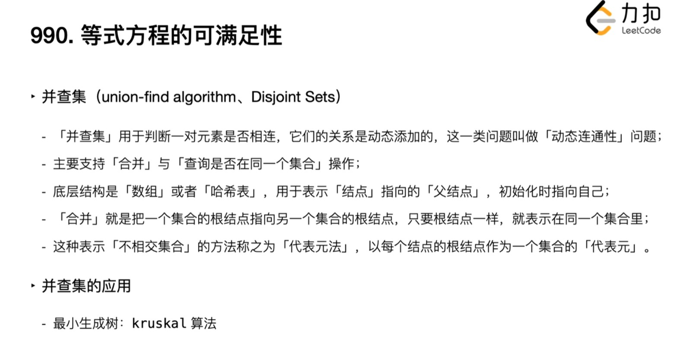

# LeetCode Everyday

## **(18)** 4Sum

### Content

- `0 <= a, b, c, d < n`
- `a`, `b`, `c`, and `d` are **distinct**.
- `nums[a] + nums[b] + nums[c] + nums[d] == target`

You may return the answer in **any order**.

 

**Example 1:**

```
Input: nums = [1,0,-1,0,-2,2], target = 0
Output: [[-2,-1,1,2],[-2,0,0,2],[-1,0,0,1]]
```

**Constraints:**

- `1 <= nums.length <= 200`
- `-109 <= nums[i] <= 109`
- `-109 <= target <= 109`

### Try1

NaN

### Solutions

#### Two pointers

Sort array first

Call kSum with start = 0, k = 4 and target, return at last

​		At the beginning of the kSum function, we will check three conditions:

​				How we run out of numbers

​				Lowest number of numbers: <= target / k

​				Largest number of numbers: >= target / k

​		

​		If k == 2, call twoSum

​		Iterate i through array

​				If value == the one before, skip it

​				Recursively call kSum with start = i + 1, k = k - 1, and target - num[i]

​				For each return a subset

​						Add this subset to Res

TwoSum function:

​		Set the low pointer form lo to start, and high pointer to the last index

​		While lo < hi:

​				if the sum of num[lo] and num[hi] < than target, lo++

​				if num[lo] == num[lo - 1], lo++

​				if the sum > target, hi--

​				if num[hi] == num[hi + 1], hi--

​				found a pair: Add it to the Res, hi-- and lo++

​		Return Res

### Review

- Boundaries 
  - Number of num
  - Most special: target // 2 + target // 2 = target

## (985) Sum of Even Numbers After Queries

### Content

```
Input: nums = [1,2,3,4], queries = [[1,0],[-3,1],[-4,0],[2,3]]
Output: [8,6,2,4]
Explanation: At the beginning, the array is [1,2,3,4].
After adding 1 to nums[0], the array is [2,2,3,4], and the sum of even values is 2 + 2 + 4 = 8.
After adding -3 to nums[1], the array is [2,-1,3,4], and the sum of even values is 2 + 4 = 6.
After adding -4 to nums[0], the array is [-2,-1,3,4], and the sum of even values is -2 + 4 = 2.
After adding 2 to nums[3], the array is [-2,-1,3,6], and the sum of even values is -2 + 6 = 4.
```

### Try1

def A:

if integer is even, append(1), [[nums[i], bool], XX, XX, XX]

def B:

if  ( $A[i][2]$ ):

sum


for i in range(len())

​	if odd and A[] [] == 0 

​			change A[] []

​	elif even

......

Change bool first

do the sum later


```python
class Solution:
    def sumEvenAfterQueries(self, nums: List[int], queries: List[List[int]]) -> List[int]:
        res = []
        Nums = []
        
        for i in range(len(nums)):
            temp = []
            temp.append(nums[i])
            temp.append(nums[i] % 2)
            # even for bool 0
            Nums.append(temp)
  
        for i in range(len(nums)):
            sum = 0

            Nums[queries[i][1]][0] = Nums[queries[i][1]][0] + queries[i][0]
         
            if queries[i][0] % 2 :
                Nums[queries[i][1]][1] = int(not Nums[queries[i][1]][1])
               
            for i in range(len(nums)):
                if not Nums[i][1] :
                    sum += Nums[i][0]
            res.append(sum)   
        
        return res
```

**Time Limit Exceeded**

### Solutions

#### Approach 1: Maintain Array Sum

```python
class Solution(object):
    def sumEvenAfterQueries(self, A, queries):
        S = sum(x for x in A if x % 2 == 0)
        ans = []

        for x, k in queries:
            if A[k] % 2 == 0: S -= A[k]
            A[k] += x
            if A[k] % 2 == 0: S += A[k]
            ans.append(S)

        return ans
```

Brute Force

faster than 8.64% of Python3 online submissions

#### Better speed

```python
class Solution:
    def sumEvenAfterQueries(self, nums: List[int], queries: List[List[int]]) -> List[int]:
        lst=[]
        su=0
        for k in nums:
            if k%2==0:
                su+=k
        for x,y in queries:
            if nums[y]%2==0:
                su-=nums[y]
            nums[y]+=x
            if nums[y]%2==0:
                su+=nums[y]
            lst.append(su)
        return lst
```

faster than 96.44%

### Review


## (557) Reverse Words in a String III

### Content

**Example 1:**

```
Input: s = "Let's take LeetCode contest"
Output: "s'teL ekat edoCteeL tsetnoc"
```

**Example 2:**

```
Input: s = "God Ding"
Output: "doG gniD"
```

### Try1

res = []

stack = []

s.append(' ')


for len()

​	stack.appned

​	if s[i] == [' ']

​		for len(stack)

​			res.append(stack[-1])

​			stack.pop()


res.pop(1)

return res

> Runtime: 306 ms, faster than 5.04% of Python3 online submissions for Reverse Words in a String III.

### Try2

``` python
class Solution:
    def reverseWords(self, s: str) -> str:
        res = []
        List = []
        s = list(s)
        s.append(' ')

        stack = []
        for i in range(len(s)):
            stack.append(s[i])

            if s[i] == ' ':
                List.append(stack)
                stack = []
                
        for l in List:
            for j in range(len(l)):
                res.append(l[-1])
                l.pop()
                    
        res.pop(0)
        res = ''.join(res)
        return res
```

> Runtime: 116 ms, faster than 24.29% of Python3 online submissions for Reverse Words in a String III.

### Solutions

#### Using Two Pointers

However, there is another optimal approach to reverse the string in \mathcal{O}(N/2)O(*N*/2) time in place using two pointer approach.

### Review


## (1680) Concatenation of Consecutive Binary Numbers

### Content

```
Input: n = 12
Output: 505379714
Explanation: The concatenation results in "1101110010111011110001001101010111100".
The decimal value of that is 118505380540.
After modulo 109 + 7, the result is 505379714.
```

### Try1

```python
class Solution:
    def concatenatedBinary(self, n: int) -> int:
        Len = []
        Num = []
        LL = 0
        res = 0
    
        for i in range(n):
            num = i + 1
            Num.append(num)
            b = ''
            s = 1
            while(num):
                s = num // 2
                y = num % 2
                b = b + str(y)
                num = s
            
            Len.append(len(b))

        L = sum(Len)
        
        for i in range(len(Num)):
            LL += Len[i]
            res += Num[i] * pow(2, L-LL)
        
        res = res % 1000000007
        return res
```

> Time Limit Exceeded

### Solutions

```python
class Solution:
    def concatenatedBinary(self, n: int) -> int:
        bits, res, MOD = 1, 0, 10**9 + 7
        for x in range(1, n + 1):
            res = ((res << bits) + x) % MOD
            if x == (1 << bits) - 1:
                bits += 1    
        return res
```

The bitwise left shift operator (`<<`) 

> ((res << bits) + x)
>
> x for value


```python
class Solution:
    def concatenatedBinary(self, n: int) -> int:
        s = 0
        for i in range(1, n+1):
            s = (s << i.bit_length() | i) % 1000000007    
        return s
```

### Review

n & (n-1) == 0 to indentify is it a power of 2?

100000000000

011111111111


## (112) Path Sum I

### Content

Given the `root` of a binary tree 

Given an integer `targetSum`

return true if the tree has a root-to-leaf path such that adding up all the values along the path equals `targetSum`


### Try 1

### Solutions

```python
class Solution:
    def hasPathSum(self, root: Optional[TreeNode], targetSum: int) -> bool:
        if root is None:
            return False
        if root.left is None and root.right is None and root.val == targetSum:
            return True
         
        return (self.hasPathSum(root.left, targetSum - root.val) or self.hasPathSum(root.right, targetSum - root.val))
```

### Review

How to judge the root status:

if root is None / if not root

When we need to transerve left and right nodes:

return (self.hasPathSum(root.left, targetSum - root.val) or self.hasPathSum(root.right, targetSum - root.val))

## (113) Path Sum II

### Content

Also, print the index that can be summed as targetSum:

```
Input: root = [5,4,8,11,null,13,4,7,2,null,null,5,1], targetSum = 22
Output: [[5,4,11,2],[5,8,4,5]]
```

### Try1

First tranverse the tree, 

append node

if in leaf node and targetSum is correct: 

​	append(List)

if None:

​	List = [] # clean and reset the List

### Solutions

``` python
def pathSum(self, root: TreeNode, sum: int) -> List[List[int]]:
        rst = []
####################### List[List[]]        
        self._dfs(root, sum, rst, [])
        return rst 

    def _dfs(self, root, sum, rst, path):
        if not root:
            return 

        # add current root's value to the path 
        path.append(root.val)

        # in case this is a leaf node 
        if not root.left and not root.right:
            if not sum - root.val:
                # for primitive values, [:] is sufficient (although it is doing shallow copy)
                rst.append(path[:])
        else:
            self._dfs(root.left, sum - root.val, rst, path)
            self._dfs(root.right, sum - root.val, rst, path)

        # backtrack 
        path.pop()
```

## (990) Satisfiability of Equality Equations

### Content

each string `equations[i]` is of length `4` and takes one of two different forms: `"xi==yi"` or `"xi!=yi"`.

### Try1

```python
class Solution:
    def equationsPossible(self, equations: List[str]) -> bool:
        left = equations[0][0]
        right = equations[0][-1]
        eq = equations[0][1:3]
        equations.pop(0)
        
        for i in range(len(equations)):
            if (left == equations[i][0] and right == equations[i][-1]) or (left == equations[i][-1] and right == equations[i][0]):
                
                if eq == equations[i][1:3]:
                    equations.pop(i)
                    break
                else:
                    return False
        if equations == []:
            return True        
        self.equationsPossible(equations)
```

Just consider the interger will be 2

### Solutions



#### HashMap Union-Find

``` python
First: build a Hash Map to UnionFind
Let equal parameters union
unionFind = {}

Second: let union find each other
def find(x):
	unionFind.setdefault(x, x)
if x != unionFind[x]:
	unionFind[x] = find(unionFind[x])
return unionFind[x]

def union(x, y):
	unionFind[find(x)] = find(y)

for e in equations:
	if e[1] == '=':
		union(e[0], e[-1])
for e in equations:
	if e[1] == '!':
		if find(e[0]) == find(e[-1]):
			return False
        
return True 
```

#### Common Way

```python
class UnionFind:
    def __init__(self, size):
        self.root = [i for i in range(size)]
        # Use a rank array to record the height of each vertex, i.e., the "rank" of each vertex.
        # The initial "rank" of each vertex is 1, because each of them is
        # a standalone vertex with no connection to other vertices.
        self.rank = [1] * size

    # The find function here is the same as that in the disjoint set with path compression.
    def find(self, x):
        if x == self.root[x]:
            return x
        self.root[x] = self.find(self.root[x])
        return self.root[x]

    # The union function with union by rank
    def union(self, x, y):
        rootX = self.find(x)
        rootY = self.find(y)
        if rootX != rootY:
            if self.rank[rootX] > self.rank[rootY]:
                self.root[rootY] = rootX
            elif self.rank[rootX] < self.rank[rootY]:
                self.root[rootX] = rootY
            else:
                self.root[rootY] = rootX
                self.rank[rootX] += 1

    def connected(self, x, y):
        return self.find(x) == self.find(y)


class Solution:
    def equationsPossible(self, equations: List[str]) -> bool:
        uf = UnionFind(26)
        equations_same = [x for x in equations if x[1] == '=']
        equations_notsame = [x for x in equations if x[1] == '!']
        
        for eq in equations_same:
            
            xi, yi = ord(eq[0])-ord('a'), ord(eq[-1])-ord('a')
            uf.union(xi, yi)
                
        for eq in equations_notsame:
           
            xi, yi = ord(eq[0])-ord('a'), ord(eq[-1])-ord('a')
            if uf.connected(xi, yi):
                return False
            
        return True
```

## (1328) Break a Palindrome

### Content

Given a palindromic string of lowercase English letters `palindrome`

replace **exactly one** character with any lowercase English letter so that the resulting string is **not** a palindrome and that it is the **lexicographically smallest** one possible.

Return *the resulting string. If there is no way to replace a character to make it not a palindrome, return an **empty string**.*


`"abcc"` is lexicographically smaller than `"abcd"` because the first position they differ is at the fourth character, and `'c'` is smaller than `'d'`.


### Try1

Must be a palindrome, so we can devide it as two parts

for:

​	if a, continue

​	else replace as a

### Try2

```
class Solution:
    def breakPalindrome(self, p: str) -> str:
        p = list(p)

        if len(p)==1:
            return ""
        
        for i in range(len(p)//2):
            if not p[i] == 'a':
                p[i] = 'a'
                break
            else:
                if i == len(p)//2-1:
                    p[-1] = 'b'

        p =''.join(p) 
        return p
```

if all the half of list is **a**, just **p[-1] = 'b'**

### Solutions


## (88) Merge Sorted Array

### Content

You are given two integer arrays `nums1` and `nums2`, sorted in **non-decreasing order**, and two integers `m` and `n`, representing the number of elements in `nums1` and `nums2` respectively.

**Merge** `nums1` and `nums2` into a single array sorted in **non-decreasing order**.

### Try1

Slice the list

Merge Sort

```
```


## (334) Increasing Triplet Subsequence

### Content

Given an integer array `nums`, return `true` *if there exists a triple of indices* `(i, j, k)` *such that* `i < j < k` *and* `nums[i] < nums[j] < nums[k]`. If no such indices exists, return `false`.

### Try1(Failed)

Have a [] List to set the triplet

do L.append(nums[0])

nums.pop(0)

while(nums)

​	if nums[0] <

​	exchange 

### Try2(Failed)

Don't look it as a array

Think about their differnece

Let L[] = [n[i+1] - n[i]]

We just want to see two increases

means

```python
class Solution:
    def increasingTriplet(self, n: List[int]) -> bool:
        D = []
        l = len(n)
        for i in range(l-1):
            D.append(n[i+1]-n[i])
        
        for i in range(0, l-2):
            for j in range(1 , l-1):
                if D[i]>0 and D[j]>0 and i != j:
                    print(D,D[i], D[j])
                    if n[i] < n[j] or n[i+1] < n[j+1]:
                        
                        return True
        
        return False
```

### Solutions

```python
class Solution:
def increasingTriplet(nums):
    first = second = float('inf')
    for n in nums:
        if n <= first:
            first = n
        elif n <= second:
            second = n
        else:
            return True
    return False
```

$O(n)$

```Python
class Solution:
    def increasingTriplet(self, nums: List[int]) -> bool:
        min1 = min2 = float("inf")
        for i, n in enumerate(nums):
            if min1 < min2 < n:
                return True
            elif n < min1:
                min1 = n
            elif min1 < n < min2:
                min2 = n
        return False
```

$O(n^2)$

### Review: Array & Greedy & O(n)

## (976) Largest Perimeter Triangle

### Content


### Try1(Success)

```python
class Solution:
    def largestPerimeter(self, nums: List[int]) -> int:
        #a+b>c,a>c-b
        sum = 0
        S = 0
        tmp = 0
        nums = sorted(nums)
        l1 = nums[0]
        l2 = nums[1]

        for i in range(2, len(nums)):
            print(l1, l2, nums[i])
            if l1 + l2 > nums[i] and l1 > abs(l2 - nums[i]):
                sum = l1 + l2 + nums[i]
                if S < sum:
                    S = sum
            if l1 > l2:
                tmp = l2
                l2 = l1
                l1 = tmp
            if nums[i] > l1:
                l1 = nums[i]

        return S
```

### Solutions

#### Sort

Just consider the last of them

```python
class Solution(object):
    def largestPerimeter(self, A):
        A.sort()
        for i in xrange(len(A) - 3, -1, -1):
            if A[i] + A[i+1] > A[i+2]:
                return A[i] + A[i+1] + A[i+2]
        return 0
```

### Review: Sort & Math

## (443) String Compression

### Content

**Example 1:**

```
Input: chars = ["a","a","b","b","c","c","c"]
Output: Return 6, and the first 6 characters of the input array should be: ["a","2","b","2","c","3"]
Explanation: The groups are "aa", "bb", and "ccc". This compresses to "a2b2c3".
```

**Example 2:**

```
Input: chars = ["a"]
Output: Return 1, and the first character of the input array should be: ["a"]
Explanation: The only group is "a", which remains uncompressed since it's a single character.
```

### Try1(Failed)

for 1:n

​	if n[i] == n[i-1]:

​	count += 1

​	else:

​	string.append()

### Solutions

#### Two Pointers

```python
class Solution:
    def compress(self, chars):
        walker, runner = 0, 0
        while runner < len(chars):
		
            chars[walker] = chars[runner]
            count = 1
			
            while runner + 1 < len(chars) and chars[runner] == chars[runner+1]:
                runner += 1
                count += 1
			
            if count > 1:
                for c in str(count):
                    chars[walker+1] = c
                    walker += 1
            
            runner += 1
            walker += 1
        
        return walker
```

### Review: Two Pointers & String

## (1531) String Compression II

### Content

[Run-length encoding](http://en.wikipedia.org/wiki/Run-length_encoding) is a string compression method that works by replacing consecutive identical characters (repeated 2 or more times) with the concatenation of the character and the number marking the count of the characters (length of the run). For example, to compress the string `"aabccc"` we replace `"aa"` by `"a2"` and replace `"ccc"` by `"c3"`. Thus the compressed string becomes `"a2bc3"`.

Notice that in this problem, we are not adding `'1'` after single characters.

Given a string `s` and an integer `k`. You need to delete **at most** `k` characters from `s` such that the run-length encoded version of `s` has minimum length.

Find the *minimum length of the run-length encoded version of* `s` *after deleting at most* `k` *characters*.

 **Example 1:**

```
Input: s = "aaabcccd", k = 2
Output: 4
Explanation: Compressing s without deleting anything will give us "a3bc3d" of length 6. Deleting any of the characters 'a' or 'c' would at most decrease the length of the compressed string to 5, for instance delete 2 'a' then we will have s = "abcccd" which compressed is abc3d. Therefore, the optimal way is to delete 'b' and 'd', then the compressed version of s will be "a3c3" of length 4.
```

**Example 2:**

```
Input: s = "aabbaa", k = 2
Output: 2
Explanation: If we delete both 'b' characters, the resulting compressed string would be "a4" of length 2.
```

**Example 3:**

```
Input: s = "aaaaaaaaaaa", k = 0
Output: 3
Explanation: Since k is zero, we cannot delete anything. The compressed string is "a11" of length 3.
```

### Try1(Failed)

build a hashmap to store the count number

### Solutions

#### Dynamic Programming

[Huahua leetcode lesson](https://www.youtube.com/watch?v=UIK00l_AiPQ)

When Brute:


very slow

four dimension dp


```Python
class Solution:
    def getLengthOfOptimalCompression(self, s: str, k: int) -> int:
        @cache
        def dp(i, prev, prev_cnt, k):
            # set it to inf as we will take the min later
            if k < 0: return inf
            # we delete all characters, return 0
            if i == len(s): return 0
            # here we can have two choices, we either
            # 1. delete the current char
            # 2. keep the current char
            # we calculate both result and take the min one
            delete = dp(i + 1, prev, prev_cnt, k - 1)
            if s[i] == prev:
                # e.g. a2 -> a3
                keep = dp(i + 1, prev, prev_cnt + 1, k)
                # add an extra 1 for the following cases
                # since the length of RLE will be changed
                # e.g. prev_cnt = 1: a -> a2
                # e.g. prev_cnt = 9: a9 -> a10
                # e.g. prev_cnt = 99: a99 -> a100 
                # otherwise the length of RLE will not be changed
                # e.g. prev_cnt = 3: a3 -> a4
                # e.g. prev_cnt = 8: a8 -> a9
                # alternative you can calculate `RLE(prev_cnt + 1) - RLE(cnt)`
                if prev_cnt in [1, 9, 99]:
                    keep += 1
            else:
                # e.g. a
                keep = dp(i + 1, s[i], 1, k) + 1
            return min(delete, keep)
        
        # dp(i, prev, prev_cnt, k) returns the length of RLE with k characters to be deleted
        # starting from index i 
        # with previous character `prev`
        # with `prev_cnt` times repeated so far
        return dp(0, "", 0, k)
```

```python
class Solution:
    def getLengthOfOptimalCompression(self, s: str, k: int) -> int:
        # Find min lenth of the code starting from group ind, if there are res_k characters to delete and 
		#       group ind needs to be increased by carry_over additional characters
        def FindMinLen(ind, res_k, carry_over=0): 
            
            # If we already found the min length - just retrieve it (-1 means we did not calculate it)
            if carry_over == 0 and dynamic[ind][res_k] != -1:
                return dynamic[ind][res_k]
            
            # Number of character occurences that we need to code. Includes carry-over.
            cur_count = carry_over + frequency[ind]

            # Min code length if the group ind stays intact. The code accounts for single-character "s0" vs. "s"  situation.
            min_len = 1 + min(len(str(cur_count)), cur_count - 1) + FindMinLen(ind+1,res_k)

            # Min length if we keep only 0, 1, 9, or 99 characters in the group - delete the rest, if feasible
            for leave_count, code_count in [(0,0), (1, 1), (9, 2), (99, 3)]:
                if cur_count > leave_count and res_k >= cur_count - leave_count:
                    min_len = min(min_len, code_count + FindMinLen(ind + 1,res_k - (cur_count - leave_count)))

            # If we drop characters between this character group and next group, like drop "a" in "bbbabb"
            next_ind = chars.find(chars[ind], ind + 1)
            delete_count = sum(frequency[ind+1:next_ind])
            if next_ind > 0 and res_k >= delete_count:
                min_len = min(min_len, FindMinLen(next_ind, res_k - delete_count, carry_over = cur_count))

            # If there was no carry-over, store the result
            if carry_over == 0: dynamic[ind][res_k] = min_len
            return min_len
        
        # Two auxiliary lists - character groups (drop repeated) and number of characters in the group
        frequency, chars = [], ""
        for char in s:
            if len(frequency)==0 or char != chars[-1]:
                frequency.append(0)
                chars = chars + char
            frequency[-1] += 1
        
        # Table with the results. Number of character groups by number of available deletions.  
        dynamic = [[-1] * (k + 1) for i in range(len(frequency))] + [[0]*(k + 1)]
        
        return FindMinLen(0, k)
```

Beats 90%

### Review: DP^4

## Count and Say

### Content

```
Input: n = 4
Output: "1211"
Explanation:
countAndSay(1) = "1"
countAndSay(2) = say "1" = one 1 = "11"
countAndSay(3) = say "11" = two 1's = "21"
countAndSay(4) = say "21" = one 2 + one 1 = "12" + "11" = "1211"
```

### Try1(Success)

Use recursive

how to encode it


split the substring first

two parameters: len() and values

```Python
class Solution:
    def countAndSay(self, n: int) -> str:
        string = "1"

        if n != 1:
            
            while n-1 :
                
                walk,run = 1,0
                Count,Number = [],[string[0]]
                l = len(string) 
                while l-1:

                    run += 1
                    if string[run] == string[run-1]:
                        walk += 1
                    else:
                        Count.append(walk)
                        walk = 1
                        Number.append(string[run])
                    l-=1
                Count.append(walk)
                if n ==2:
                    print(Count,Number)                
                
                string = ""
                for i in range(len(Count)):
                    string += str(Count[i])
                    string += str(Number[i])

                n-=1

        return string
```

### Solutions

The same as I think

```python
     def countAndSay(self, n):
        s = '1'
        for _ in range(n-1):
            let, temp, count = s[0], '', 0
            for l in s:
                if let == l:
                    count += 1
                else:
                    temp += str(count)+let
                    let = l
                    count = 1
            temp += str(count)+let
            s = temp
        return s
```

### Review: String

## (692) Top K Frequent Words

### Content

**Example 2:**

```
Input: words = ["the","day","is","sunny","the","the","the","sunny","is","is"], k = 4
Output: ["the","is","sunny","day"]
Explanation: "the", "is", "sunny" and "day" are the four most frequent words, with the number of occurrence being 4, 3, 2 and 1 respectively.
```

### Try1(Failed)

Use hashmap to store

use value to count

for value:

​	if max

### Solutions

#### Heap

```python
class Solution:
    def topKFrequent(self, words: List[str], k: int) -> List[str]:
        dic = {}
        for i in words:
            if i not in dic:
                dic[i] = 1
            else:
                dic[i] += 1
        max_heap = []
        max_count = 0
        for i in dic:
            if dic[i] > max_count:
                max_count = dic[i]
        res = []
        for i in dic:
            res.append((i,dic[i]))
        res.sort(key = lambda x: x[1])
        for value,count in res:
            heapq.heappush(max_heap,((-1*count),value))
        ans = []
        for i in range(k):
            count,word = heapq.heappop(max_heap)
            ans.append(word)
        return ans   
```

#### Hashtable

```Python
class Solution:
    def topKFrequent(self, words: List[str], k: int) -> List[str]:
        dict = {}
        for x in words:
            if x in dict:
                dict[x] += 1
            else:
                dict[x] = 1
        res = sorted(dict, key=lambda x: (-dict[x], x))
        return res[:k]
```

### Review: Heap & Heapq & Lambda

#### Heapq

Use heap to create heap:

```python
# coding=utf-8
import heapq


array = [10, 17, 50, 7, 30, 24, 27, 45, 15, 5, 36, 21]
heap = []
for num in array:
    heapq.heappush(heap, num)
print("array:", array)
print("heap: ", heap)

heapq.heapify(array)
print("array:", array)
-->
array: [10, 17, 50, 7, 30, 24, 27, 45, 15, 5, 36, 21]
heap:  [5, 7, 21, 15, 10, 24, 27, 45, 17, 30, 36, 50]
array: [5, 7, 21, 10, 17, 24, 27, 45, 15, 30, 36, 50]
```

heappush(heap, num)，先创建一个空堆，然后将数据一个一个地添加到堆中。每添加一个数据后，heap都满足小顶堆的特性。

heapify(array)，直接将数据列表调整成一个小顶堆(调整的原理参考上面堆排序的文章，heapq库已经实现了)。

两种方法实现的结果会有差异，如上面的代码中，使用heappush(heap, num)得到的堆结构如下。


Max and min

```python
array = [10, 17, 50, 7, 30, 24, 27, 45, 15, 5, 36, 21]
heapq.heapify(array)
print(heapq.nlargest(2, array))
print(heapq.nsmallest(3, array))
-->
[50, 45]
[5, 7, 10]
```


Merge sorted list

```py
array_a = [10, 7, 15, 8]
array_b = [17, 3, 8, 20, 13]
array_merge = heapq.merge(sorted(array_a), sorted(array_b))
print("merge result:", list(array_merge))
-->
merge result: [3, 7, 8, 8, 10, 13, 15, 17, 20]
```


replace data: pop and push

```python
array_c = [10, 7, 15, 8]
heapq.heapify(array_c)
print("before:", array_c)
# 先push再pop
item = heapq.heappushpop(array_c, 5)
print("after: ", array_c)
print(item)

array_d = [10, 7, 15, 8]
heapq.heapify(array_d)
print("before:", array_d)
# 先pop再push
item = heapq.heapreplace(array_d, 5)
print("after: ", array_d)
print(item)
-->
before: [7, 8, 15, 10]
after:  [7, 8, 15, 10]
5
before: [7, 8, 15, 10]
after:  [5, 8, 15, 10]
7
```

heappushpop(heap, num)，先将num添加到堆中，然后将堆顶的数据出堆。

heapreplace(heap, num)，先将堆顶的数据出堆，然后将num添加到堆中。


#### Lambda

**filter函数** 此时lambda函数用于指定过滤列表元素的条件。例如filter(lambda x: x % 3 == 0, [1, 2, 3])指定将列表[1,2,3]中能够被3整除的元素过滤出来，其结果是[3]。

**sorted函数** 此时lambda函数用于指定对列表中所有元素进行排序的准则。例如sorted([1, 2, 3, 4, 5, 6, 7, 8, 9], key=lambda x: abs(5-x))将列表[1, 2, 3, 4, 5, 6, 7, 8, 9]按照元素与5距离从小到大进行排序，其结果是[5, 4, 6, 3, 7, 2, 8, 1, 9]。

**map函数** 此时lambda函数用于指定对列表中每一个元素的共同操作。例如map(lambda x: x+1, [1, 2,3])将列表[1, 2, 3]中的元素分别加1，其结果[2, 3, 4]。

**reduce函数** 此时lambda函数用于指定列表中两两相邻元素的结合条件。例如reduce(lambda a, b: '{}, {}'.format(a, b), [1, 2, 3, 4, 5, 6, 7, 8, 9])将列表 [1, 2, 3, 4, 5, 6, 7, 8, 9]中的元素从左往右两两以逗号分隔的字符的形式依次结合起来，其结果是'1, 2, 3, 4, 5, 6, 7, 8, 9'。

## (12) Integer to Roman

### Content

**Example 1:**

```
Input: num = 3
Output: "III"
Explanation: 3 is represented as 3 ones.
```

**Example 2:**

```
Input: num = 58
Output: "LVIII"
Explanation: L = 50, V = 5, III = 3.
```

**Example 3:**

```
Input: num = 1994
Output: "MCMXCIV"
Explanation: M = 1000, CM = 900, XC = 90 and IV = 4.
```

### Try1

That's code of Roman to Integer:

```python
class Solution:
    def romanToInt(self, s: str) -> int:
        L = []
        S = 0
        count = 0

        def cal(self, n):
            if n == 'I':
                return 1
            elif n == 'V':
                return 5
            elif n == 'X':
                return 10
            elif n == 'L':
                return 50
            elif n == 'C':            
                return 100
            elif n == 'D':            
                return 500
            elif n == 'M':            
                return 1000

        for i in range(1,len(s)):
            if cal(self, n = s[i-1])>= cal(self, n = s[i]):
                S+= cal(self, n = s[i-1] )
            else:
                S-= cal(self, n = s[i-1]) 
        S += cal(self, n = s[-1])

        return S
```

That's Try1

```python
class Solution:
    def intToRoman(self, num: int) -> str:
        res = ""

        while num:
            if num // 1000 > 0:
                res += "M"
                num = num -  1000
            
            elif num // 900 > 0:
                res += "CM"
                num = num -  900

            elif num // 500 > 0:
                res += "D"
                num = num -  500

            elif num // 400 > 0:
                res += "CD"
                num = num -  400 

            elif num // 100 > 0:
                res += "C"
                num = num - 100

            elif num // 90 > 0:
                res += "XC"
                num = num -  90 

            elif num // 50 > 0:
                res += "L"
                num = num -  50

            elif num // 40 > 0:
                res += "XL"
                num = num -  40 
            
            elif num // 10 > 0:
                res += "X"
                num = num -  10 

            elif num // 9 > 0:
                res += "IX"
                num = num -  9

            elif num // 5 > 0:
                res += "V"
                num = num -  5

            elif num // 4 > 0:
                res += "IV"
                num = num -  4

            else:
                res += "I"
                num = num - 1   

        return res
```

### Solutions

```python
class Solution:
    def intToRoman(self, N: int) -> str:
        val = [1000,900,500,400,100,90,50,40,10,9,5,4,1]
        rom = ["M","CM","D","CD","C","XC","L","XL","X","IX","V","IV","I"]
        ans = ""
        for i in range(13):
            while N >= val[i]:
                ans += rom[i]
                N -= val[i]
        return ans
```

### Review: String & Hashtable

## (1832) Check if the Sentence is Pangram

### Content

A **pangram** is a sentence where every letter of the English alphabet appears at least once.

Given a string `sentence` containing only lowercase English letters, return `true` *if* `sentence` *is a **pangram**, or* `false` *otherwise.*

### Try1(Success)

Use hashtable to store, len(H) == 26

```python
class Solution:
    def checkIfPangram(self, sentence: str) -> bool:
        H ={}

        for s in sentence:
            if not s in H:
                H[s] = 1

        return len(H) == 26 
```

So fucking easy

### Solutions

#### Traverse 26 times

O(26*n)

#### Set

```python
class Solution:
    def checkIfPangram(self, sentence: str) -> bool:
        # Add every letter of 'sentence' to hash set 'seen'.
        seen = set(sentence)
        
        # If the size of 'seen' is 26, then 'sentence' is a pangram.
        return len(seen) == 26
```

### Review: Hashtable & Set

## (75) Sorted Colors

### Content

Basic Sorted problem, first time C++ solution

### Try1(Falied)

### Solutions

#### Sort function

```cpp
class Solution {
public:
    void sortColors(vector<int>& nums) {
       sort(nums.begin(), nums.end());
    }
};
```

#### Keep a count of 0's 1's and 2's**
Time complexity - O(2N)

```cpp
class Solution {
public:
    void sortColors(vector<int>& nums) {
        int count0 = 0;
        int count1 = 0; 
        int count2  = 0;
        for(int i =0; i< nums.size(); i++){
            if(nums[i] == 0){
                count0++;
            }else if (nums[i] == 1){
                count1++;
            }else if (nums[i] ==2 ){
                count2++;
            }
            
         }
        for(int i =0; i< count0; i++){
            nums[i] =0;
        }
        for(int i =count0; i< (count1 + count0); i++){
            nums[i] =1;
        }
        for(int i =(count1 + count0); i< nums.size(); i++){
            nums[i] =2;
        }
        
    }
};
```

#### **Using 3 pointers**
Time complexity - O(N)

```cpp
class Solution {
public:
    void sortColors(vector<int>& nums) {
        int low =0; 
        int high = nums.size()-1;
        int mid =0;
        
        while(mid <= high){
            if(nums[mid] == 0){
                swap(nums[mid], nums[low]);
                low++;
                mid++;
            }
            else if(nums[mid] == 1){
                mid++;
            }
            else {
                swap(nums[mid], nums[high]);
                high--;
            }
        }
    }
```

### Review: Tradtional Sorting

swap(nums[i], nums[j])

## (128) Longest Consecutive Sequence

### Content

Given an unsorted array of integers `nums`, return *the length of the longest consecutive elements sequence.*

You must write an algorithm that runs in `O(n)` time.

### Try1(Failed)

### Solutions

#### Brute

```python
class Solution:
    def longestConsecutive(self, nums):
        longest_streak = 0

        for num in nums:
            current_num = num
            current_streak = 1

            while current_num + 1 in nums:
                current_num += 1
                current_streak += 1

            longest_streak = max(longest_streak, current_streak)

        return longest_streak
```

- Time complexity : O(n3)O(n^3)*O*(*n*3).

  The outer loop runs exactly nn*n* times, and because `currentNum` increments by 1 during each iteration of the `while` loop, it runs in O(n)O(n)*O*(*n*) time. Then, on each iteration of the `while` loop, an O(n)O(n)*O*(*n*) lookup in the array is performed. Therefore, this brute force algorithm is really three nested O(n)O(n)*O*(*n*) loops, which compound multiplicatively to a cubic runtime.

#### Sorting


#### Set

- Insert all the elements of the array into set.
- **Check if the previous number (nums[i] - 1) is present in the set**, if it is then that number (nums[i]) is not the starting of the sequence.
- If previous number is not present, that means that number is the starting of the sequence.
- Make a count variable to count the length of the sequence and current variable to store the current number.
- Now in a while loop, traverse and keep searching for consecutive elements until the condition is false.
- Now store the maximum of longest_sequence and current length of the sequence.

```c++
class Solution {
public:
    int longestConsecutive(vector<int>& nums) {
        unordered_set<int> s(nums.begin(),nums.end()); // this is faster
        
        // for(int i = 0; i<nums.size(); i++)
        // {
        //     s.insert(nums[i]);
        // }
        
        int longest_sequence = 0;
        
        for(int i=0; i<nums.size(); i++)
        {
            if(s.find(nums[i] - 1)!=s.end())
                continue;
            
            else
            {
                int count = 0;
                int current_element = nums[i];
                
                while(s.find(current_element) != s.end())
                {
                    count++;
                    current_element++;
                }
                
                longest_sequence = max(longest_sequence,count);
            }
        }
        
        return longest_sequence;
    }
};
```

### Review: Hash Table & Union Find

```cpp
class Solution {
public:
    int longestConsecutive(vector<int>& nums) {
        std::cout << "Hello World!\n";
            return 0;
    }
};
```

Whether is the begin of the consecutive sequence:

```
if(s.find(nums[i] - 1)!=s.end())
```


## (4) Median of Two Sorted Arrays

### Content

Given two sorted arrays `nums1` and `nums2` of size `m` and `n` respectively, return **the median** of the two sorted arrays.

> **The overall run time complexity should be `O(log (m+n))`.**

### Try1


### Solutions

### Review:

## (645) Set Mismatch

### Content

**Example 1:**

```
Input: nums = [1,2,2,4]
Output: [2,3]
```

**Example 2:**

```
Input: nums = [1,1]
Output: [1,2]
```

### Try1


### Solutions

### Review: 

## (76) Minimum Window Substring

### Content

Given two strings `s` and `t` of lengths `m` and `n` respectively, return *the **minimum window substring** of* `s` *such that every character in* `t` *(**including duplicates**) is included in the window. If there is no such substring, return the empty string* `""`*.*

The testcases will be generated such that the answer is **unique**.

A **substring** is a contiguous sequence of characters within the string.

### Try1(Failed)

### Solutions

#### Sliding Window

The algorithm of sliding window:

1. We start with two pointers, leftleft*l**e**f**t* and rightright*r**i**g**h**t* initially pointing to the first element of the string SS*S*.
2. We use the rightright*r**i**g**h**t* pointer to expand the window until we get a desirable window i.e. a window that contains all of the characters of TT*T*.
3. Once we have a window with all the characters, we can move the left pointer ahead one by one. If the window is still a desirable one we keep on updating the minimum window size.
4. If the window is not desirable any more, we repeat step  2step \; 2*s**t**e**p*2 onwards.

```python
def minWindow(self, s, t):
    """
    :type s: str
    :type t: str
    :rtype: str
    """
    if not t or not s:
        return ""

    # Dictionary which keeps a count of all the unique characters in t.
    dict_t = Counter(t)

    # Number of unique characters in t, which need to be present in the desired window.
    required = len(dict_t)

    # left and right pointer
    l, r = 0, 0

    # formed is used to keep track of how many unique characters in t are present in the current window in its desired frequency.
    # e.g. if t is "AABC" then the window must have two A's, one B and one C. Thus formed would be = 3 when all these conditions are met.
    formed = 0

    # Dictionary which keeps a count of all the unique characters in the current window.
    window_counts = {}

    # ans tuple of the form (window length, left, right)
    ans = float("inf"), None, None

    while r < len(s):

        # Add one character from the right to the window
        character = s[r]
        window_counts[character] = window_counts.get(character, 0) + 1

        # If the frequency of the current character added equals to the desired count in t then increment the formed count by 1.
        if character in dict_t and window_counts[character] == dict_t[character]:
            formed += 1

        # Try and contract the window till the point where it ceases to be 'desirable'.
        while l <= r and formed == required:
            character = s[l]

            # Save the smallest window until now.
            if r - l + 1 < ans[0]:
                ans = (r - l + 1, l, r)

            # The character at the position pointed by the `left` pointer is no longer a part of the window.
            window_counts[character] -= 1
            if character in dict_t and window_counts[character] < dict_t[character]:
                formed -= 1

            # Move the left pointer ahead, this would help to look for a new window.
            l += 1    

        # Keep expanding the window once we are done contracting.
        r += 1    
    return "" if ans[0] == float("inf") else s[ans[1] : ans[2] + 1]
```

### Review: Sliding Window & Counter()

```
>>> Counter("mississippi")
Counter({'i': 4, 's': 4, 'p': 2, 'm': 1})
```


## (49) Group Anagrams

### Content

**Example 1:**

```
Input: strs = ["eat","tea","tan","ate","nat","bat"]
Output: [["bat"],["nat","tan"],["ate","eat","tea"]]
```

**Example 2:**

```
Input: strs = [""]
Output: [[""]]
```

### Try1

Sort first

Use hashmap to store


### Solutions


## (766) Toeplitz Matrix

### Content

### Try1(Failed)

### Solutions

```c++
class Solution {
public:
    bool isToeplitzMatrix(vector<vector<int>>& matrix) {
	for (int i = 0; i < matrix.size() - 1; i++) {
		for (int j = 0;  j < matrix[0].size() - 1; j++) {
			if (matrix[i][j] != matrix[i + 1][j + 1])
				return false;
		}
	}
	return true;
}
};

```

### Review: Matrix


## (1323) Maximum 69 Number

### Content

You are given a positive integer `num` consisting only of digits `6` and `9`.

Return *the maximum number you can get by changing **at most** one digit (*`6` *becomes* `9`*, and* `9` *becomes* `6`*)*.

**Example 1:**

```
Input: num = 9669
Output: 9969
Explanation: 
Changing the first digit results in 6669.
Changing the second digit results in 9969.
Changing the third digit results in 9699.
Changing the fourth digit results in 9666.
The maximum number is 9969.
```

### Try1(Success)

Use string

```python
class Solution:
    def maximum69Number (self, num: int) -> int:
        nums = str(num)
        l = len(nums)
        i = 0
        for s in nums:
            i += 1
            if s != "9":
                num += 3 * pow(10,(l - i) )
                return num
        return num
```

### Solutions

### Review: Math


## (1544) Make The String Great

### Contetent

A good string is a string which doesn't have **two adjacent characters** `s[i]` and `s[i + 1]` where:

- `0 <= i <= s.length - 2`
- `s[i]` is a lower-case letter and `s[i + 1]` is the same letter but in upper-case or **vice-versa**.

### Try1(Success)

Use a stack to store the character

Upper case is 32 less than lowercase

Every step forward, every judegement

```python
class Solution:
    def makeGood(self, s: str) -> str:
        string = []
        stack = []

        for ss in s:
            string.append(ss)

        for i in range(len(string)):
            stack.append(string[i])
            
            while (len(stack) > 1 and (ord(stack[-2]) == ord(stack[-1]) + 32 or ord(stack[-2]) == ord(stack[-1]) - 32)):
                stack.pop()
                stack.pop()

        res = ''.join(stack) 
        return res
```

### Solutions

Using C++ to change characters, it has $O(1)$ Space Complexity

```C++
class Solution {
public:
    string makeGood(string s) {
        // Initialize 'end = 0' since the good string is empty.
        int end = 0;
        for (int cur = 0; cur < s.size(); ++cur) {
            // If s[cur] makes a pair with the last character s[end - 1] in good string,
            // remove s[end - 1] by decrementing 'end' by 1. 
            // Otherwise, add s[cur] to the good string by overwritting s[end] by s[cur].
            if (end > 0 && abs(s[cur] - s[end - 1]) == 32)
                end--;
            else {
                s[end] = s[cur];
                end++;
            }
        }
        
        // Once the iteration ends, the string before 'end' is the good string.
        return s.substr(0, end);  
    }
};
```

### Review: Stack & ASCII

```

ch=input("请输入一个字符：")
print(ch,"的ASCII码为：",ord(ch))
```


## (901) Online Stock Span

### Content

Design an algorithm that collects daily price quotes for some stock and returns **the span** of that stock's price for the current day.

The **span** of the stock's price today is defined as the maximum number of consecutive days (starting from today and going backward) for which the stock price was less than or equal to today's price.

- For example, if the price of a stock over the next `7` days were `[100,80,60,70,60,75,85]`, then the stock spans would be `[1,1,1,2,1,4,6]`.

Implement the `StockSpanner` class:

- `StockSpanner()` Initializes the object of the class.
- `int next(int price)` Returns the **span** of the stock's price given that today's price is `price`.


### Try1


## (233) Rectangle Area

### Content


### Try1(Success)

$S1 = (ax2 - ax1) * (ay2 - ay1)$

S2

if overleap

$S_o$

else


define overleap:

both contract


res = S1 + S2 - So

```python
class Solution:
    def computeArea(self, ax1: int, ay1: int, ax2: int, ay2: int, bx1: int, by1: int, bx2: int, by2: int) -> int:
        S1 = (ax2 - ax1) * (ay2 - ay1)
        S2 = (bx2 - bx1) * (by2 - by1)
        SO = 0

        if(((ax2 > bx1) and (ax1 < bx2)) or ((bx2 > ax1) and (bx1 < ax2))) and (((ay2 > by1) and (ay1 < by2)) or ((by2 > ay1) and (by1 < ay2))):
            SO = (min([ax2,bx2]) - max([ax1,bx1])) * (min([ay2,by2]) - max([ay1,by1]))

        res = S1 + S2 - SO
        return res
```

### Solutions

$O(1)$

$O(1)$

### Review: Math


## (263) Ugly Number

### Content

An **ugly number** is a positive integer whose prime factors are limited to `2`, `3`, and `5`.

Given an integer `n`, return `true` *if* `n` *is an **ugly number***.

### Try1(Failed)

Find all the factors

Find prime factor s

if s in [2, 3, 5]

else

### Solutions
