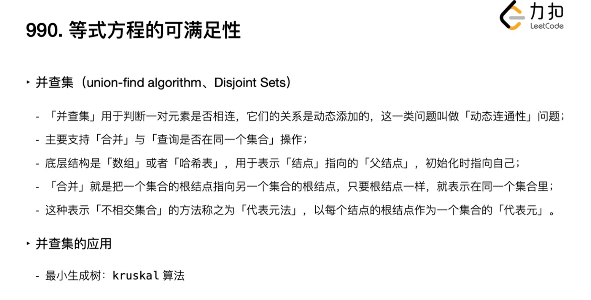

[TOC]

## Word Lists

enumerate 枚举

duplicate 重复

recursion 

recursively 递归

Iterate 迭代

increase

increment 增加

brackets 括号

traverse 遍历

ascend 向上


------

# Grind 75

## (1) Two Sum

### Content

**Example 1:**

```
Input: nums = [2,7,11,15], target = 9
Output: [0,1]
Explanation: Because nums[0] + nums[1] == 9, we return [0, 1].
```

You may assume that each input would have ***exactly\* one solution**, and you may not use the *same* element twice.

**Constraints:**

- **Only one valid answer exists.**

### Try1

```
Boudaries:

lo < hi

lo < target // 2

hi > target // 2


Sort the List first

​		for i in range(0,len)
​				lo = i
​				While lo < hi						
​				if  num[lo] + num[hi] == target
​						res = 						
​						return res
​				else
​						hi--	
```


### Try2

```python
class Solution:
    def twoSum(self, nums: List[int], target: int) -> List[int]:
        lo = 0
        while(1):
            time = 1
            hi = len(nums) - time
            while (lo < hi):
                if nums[lo] + nums[hi] == target:
                    res = []
                    res.append(lo)
                    res.append(hi)
                    return res
                else:
                    hi = hi - 1
            lo = lo + 1
```

### Solutions

#### Brute Force

Two loop,  $O(n^2)$

```
for i in range(len(nums)):
            for j in range(i + 1, len(nums)):
                if nums[j] == target - nums[i]:
                    return [i, j]
```

#### Two-pass Hash Table

Have a map

check $target - nums[i]$

must not be nums[i] itself!

> A simple implementation uses two iterations. In the first iteration, we add each element's value as a key and its index as a value to the hash table. Then, in the second iteration, we check if each element's complement (target - nums[i]*t**a**r**g**e**t*−*n**u**m**s*[*i*]) exists in the hash table. If it does exist, we return current element's index and its complement's index. Beware that the complement must not be nums[i]*n**u**m**s*[*i*] itself!

```python
class Solution:
    def twoSum(self, nums: List[int], target: int) -> List[int]:
        hashmap = {}
        for i in range(len(nums)):
            hashmap[nums[i]] = i
        for i in range(len(nums)):
            complement = target - nums[i]
            if complement in hashmap and hashmap[complement] != i:
                return [i, hashmap[complement]] 
```

#### One-pass Hash Table

Once you iterat and insert elements into the hash table

<u>Look back to check!</u>

```python
class Solution:
    def twoSum(self, nums: List[int], target: int) -> List[int]:
        hashmap = {}
        for i in range(len(nums)):
            complement = target - nums[i]
            if complement in hashmap:
                return [i, hashmap[complement]]
            hashmap[nums[i]] = i
```

### Review

One pass Hash Table, once you insert once you check

## (20) Valid Parentheses

### Content

string s containing just ( ) { } [ ]

input is valid if:

- Same type
- Correct order
- Pair

```
Input: s = "()[]{}"
Output: true
```

```
Input: s = "(]"
Output: false
```

- `s` consists of parentheses only `'()[]{}'`.

### Try1

str to list

for

compare every 2 digit

3 if

```python
class Solution:
    def isValid(self, s: str) -> bool:
        S = list(s)
        l = len(S)
        if not (l % 2):
            return False
        
        for i in range(l-2):
            if not (i%2):
                if (S[i] == '('):
                    if not (S[i+1] == ')'):
                        return False
                elif (S[i] == '['):
                    if not (S[i+1] == ']'):
                        return False
                elif (S[i] == '{'):
                    if not (S[i+1] == '}'):
                        return False
                else:
                    return False
        
        return True
```

### Try2

build a stack

use if X in []

if correspodding, pop()

if len(stack) == 0, True

```python
class Solution:
    def isValid(self, s: str) -> bool:
        stack = []
        i = 0
        
        if (len(s)%2):
            return False
        
        for c in s:
            i += 1
            if (i%2) :
                if c in ['(','[','{']:
                    stack.append(c)
                else:
                    return False
            else:
                if c in [')',']','}']:
                    if c == ')':
                        if not (stack[-1] == '('):
                            return False
                        else:
                            stack.pop()
                    elif c == ']':
                        if not (stack[-1] == '['):
                            return False
                        else:
                            stack.pop()
                    elif c == '}':
                        if not (stack[-1] == '{'):
                            return False
                        else:
                            stack.pop()
                else:
                    return False 
                
        if not (len(stack)):        
            return True
```

Wrong understanding: "{[]}" is True too

### Solutions

Traverse first

Stack: its `Last In First Out (LIFO)` property

Put left in first, search for right to compare

At last, it will be a empty Stack if it's right

Time: Traverse, $O(n^2)$ 

Space: Stack, $O(n^2)$ 

```python
def isValid(s: str) -> bool:
    # Stack for left symbols
    leftSymbols = []
    # Loop for each character of the string
    for c in s:
        # If left symbol is encountered
        if c in ['(', '{', '[']:
            leftSymbols.append(c)
        # If right symbol is encountered
        elif c == ')' and len(leftSymbols) != 0 and leftSymbols[-1] == '(':
            leftSymbols.pop()
        elif c == '}' and len(leftSymbols) != 0 and leftSymbols[-1] == '{':
            leftSymbols.pop()
        elif c == ']' and len(leftSymbols) != 0 and leftSymbols[-1] == '[':
            leftSymbols.pop()
        # If none of the valid symbols is encountered
        else:
            return False
    return leftSymbols == []
```

### Review


## (21) Merge Two Sorted Lists

### Content

Two sorted lists *list1* and *list2*

The list should be made by splicing together the nodes of the first two lists.


### Try1

Use Stack

Try list first, use trans def

```python
def LtoL(linkedNode):
l=[]
while linkedNode:
l.append(linkedNode.val)  
linkedNode= linkedNode.next
return l                   

def list2link(List):
if List == []:
return None

head = ListNode(List[0])
p = head
for i in range(1, len(List)):
p.next = ListNode(List[i])
p = p.next
return head
```

while(len(l1) >0 and len(l2) >0):

​	if l1[i] <= l2[j]:

​		res.append()

​		pop(0)

​	else

​		......

if len(l1)==0:

​	res.append(l2)


return res

### Solutions

Check if any of the lists is empty.

Use LinkedList

```python
# Definition for singly-linked list.
# class ListNode:
#     def __init__(self, val=0, next=None):
#         self.val = val
#         self.next = next
class Solution:
    def mergeTwoLists(self, list1: Optional[ListNode], list2: Optional[ListNode]) -> Optional[ListNode]:
        l1 = list1
        l2 = list2
        
        if l1 is None:
            return l2
        if l2 is None:
            return l1
        # Choose head which is smaller of the two lists
        if l1.val < l2.val:
            temp = head = ListNode(l1.val)
            l1 = l1.next
        else:
            temp = head = ListNode(l2.val)
            l2 = l2.next
        # Loop until any of the list becomes null
        while l1 is not     None and l2 is not None:
            if l1.val < l2.val:
                temp.next = ListNode(l1.val)
                l1 = l1.next
            else:
                temp.next = ListNode(l2.val)
                l2 = l2.next
            temp = temp.next
        # Add all the nodes in l1, if remaining
        while l1 is not None:
            temp.next = ListNode(l1.val)
            l1 = l1.next
            temp = temp.next
        # Add all the nodes in l2, if remaining
        while l2 is not None:
            temp.next = ListNode(l2.val)
            l2 = l2.next
            temp = temp.next
        return head
```

Time: For travesing and assigning value both lists, $O(m+n)$

Space: $O(1)$

### Review

```
class ListNode:
#     def __init__(self, val=0, next=None):
#         self.val = val
#         self.next = next
```

## (121) Best Time to Buy and Sell Stock

### Content

**Example 1:**

```python
Input: prices = [7,1,5,3,6,4]
Output: 5
Explanation: Buy on day 2 (price = 1) and sell on day 5 (price = 6), profit = 6-1 = 5.
Note that buying on day 2 and selling on day 1 is not allowed because you must buy before you sell.
```

If you can't have a profit, return 0

### Try1

Brute: (n-1 + 1) n / 2            $O(n^2)$

for i in range(len())

​	temp = p[0]

​	p.pop(0)	

​	res = max(p) - temp

``` python
class Solution:
    def maxProfit(self, prices: List[int]) -> int:
        temp = 0
        res = 0
        Res = 0
        p = []
        p = p + prices
        
        for i in range(len(prices)-1) :
            temp = prices[i]
            p.pop(0)
            if temp <= max(p):
                res = max(p) - temp
            if res > Res:
                Res = res
        
        return Res
```

Time Limit Exceeded

### Try2

int 3 variables, actually 2

num: real time num

Min: lowest in traverse, it will only decrase


res = num - Min

if res > Res, Res = res

```python
class Solution:
    def maxProfit(self, prices: List[int]) -> int:
        res = 0
        Res = 0
        Min = prices[0]
        
        for i in range(len(prices)):
            
            if i > 0:
                if prices[i] < prices[i-1] and prices[i] < Min:
                    Min = prices[i]
                
            res = prices[i] - Min  
            
            Res =max(Res,res)
            
        return Res
```

 ### Solutions

### Review

```
if res > Res:
                Res = res
#### Can be optimized as:
                
Res =max(Res,res)
```

## (409) Longest Palindrome

### Content

```python
Input: s = "abccccdd"
Output: 7
Explanation: One longest palindrome that can be built is "dccaccd", whose length is 7.
```

### Try1

Build a Hash Table

```python
class Solution:
    def longestPalindrome(self, s: str) -> int:
        Hashmap = {}
        l = []
        res = 0
        d = 0
        
        for i in range(len(s)):
            if s[i] not in Hashmap:
                Hashmap[s[i]] = 0
            Hashmap[s[i]] += 1
            
        for i in Hashmap:
            res += 2*(Hashmap[i]//2)
            if Hashmap[i] % 2 :
                d = 1
        
        if d:
            return res + 1
        return res
```

### Solutions

## (226) Invert Binary Tree

### Content

Given the root of a binary tree, and return its root.

```python
Input: root = [4,2,7,1,3,6,9]
Output: [4,7,2,9,6,3,1]
```

### Solutions

```python
#     def __init__(self, val=0, left=None, right=None):
#         self.val = val
#         self.left = left
#         self.right = right
class Solution:
    def invertTree(self, root: Optional[TreeNode]) -> Optional[TreeNode]:
        
        if not root or (not root.left and not root.right):
            return root
##########################################################调换左右节点
        tmp = root.left
        root.left = root.right
        root.right = tmp
#########################################################
        self.invertTree(root.left)
        self.invertTree(root.right)
        return root
```

## (125) Valid Palindrome

### Content

Given a string `s`, return `true` *if it is a **palindrome**, or* `false` *otherwise*.

**Example 1:**

```python
Input: s = "A man, a plan, a canal: Panama"
Output: true
Explanation: "amanaplanacanalpanama" is a palindrome.
```


### Try1

Use List to store string, use a pop(0),pop(-1)stack to make decesion

```python
class Solution:
    def isPalindrome(self, s: str) -> bool:
        s = s.lower()
        S = []

        for ss in s:
            if ss.isalnum():
                S.append(ss) 

        for i in range(len(S)//2):
            if S[0] == S[-1]:
                S.pop(0)
                S.pop(-1)
            else:
                return False

        if S != []:
            S.pop()

        if S == []:
            return True
```

### Solutions

#### Shortest and funny:

```python
class Solution:
    def isPalindrome(self, s: str) -> bool:
            newS= [i.lower() for i in s if i.isalnum()]
            return newS == newS[::-1]
```

#### Two Pointer!

```python
class Solution:
    def isPalindrome(self, s):
        l, r = 0, len(s)-1
        # First and Last
        while l < r:
        # Guarantee the order
            while l < r and not s[l].isalnum():
                l += 1
            while l <r and not s[r].isalnum():
                r -= 1
            if s[l].lower() != s[r].lower():
                return False
            l +=1; r -= 1
        return True
```

### Review

.lower() function

```
s.isalnum所有字符都是数字或者字母，为真返回Ture，否则返回False。（重点，这是字母数字一起判断的！！）

s.isalpha所有字符都是字母，为真返回Ture，否则返回False。（只判断字母）

s.isdigit所有字符都是数字，为真返回Ture，否则返回False。（只判断数字）

s.islower所有字符都是小写，为真返回Ture，否则返回False。

s.isupper所有字符都是大写，为真返回Ture，否则返回False。

s.istitle所有单词都是首字母大写，为真返回Ture，否则返回False。

s.isspace所有字符都是空白字符，为真返回Ture，否则返回False。
```

while l < r and not s[l].isalnum():

## (242) Valid Anagram

### Content

Given two strings `s` and `t`, return `true` *if* `t` *is an anagram of* `s`*, and* `false` *otherwise*.

**Example 1:**

```
Input: s = "anagram", t = "nagaram"
Output: true
```

### Try1

First For: Hashmap 

Use Hashmap to count

Second For: if == : 

Third For review

```python
class Solution:
    def isAnagram(self, s: str, t: str) -> bool:
        Hashmap = {}
        if len(s) != len(t):
            return False
        
        for i in range(len(s)):
            if s[i] not in Hashmap:
                Hashmap[s[i]] = 0
            Hashmap[s[i]] += 1

        for tt in t:
            if tt in Hashmap:
                Hashmap[tt] -= 1

        for key in Hashmap:
            if Hashmap[key] != 0:
                return False

        return True
```

### Solutions

#### Traditional Dictionary

```python
def isAnagram1(self, s, t):
    dic1, dic2 = {}, {}
    for item in s:
        dic1[item] = dic1.get(item, 0) + 1
    for item in t:
        dic2[item] = dic2.get(item, 0) + 1
    return dic1 == dic2
```

#### Pre set 0 Dictionary

```python
def isAnagram2(self, s, t):
    dic1, dic2 = [0]*26, [0]*26
    for item in s:
        dic1[ord(item)-ord('a')] += 1
    for item in t:
        dic2[ord(item)-ord('a')] += 1
    return dic1 == dic2
```

#### Pre set 0 Dictionary

Use Sorted()
```python
def isAnagram3(self, s, t):
    return sorted(s) == sorted(t)
```

## (704) Binary Search

### Content

Given an array of integers `nums` which is sorted in ascending order, and an integer `target`, write a function to search `target` in `nums`. If `target` exists, then return its index. Otherwise, return `-1`.

**You must write an algorithm with `O(log n)` runtime complexity.**

### Try1

```python
class Solution:
    def search(self, nums: List[int], target: int) -> int:
        if nums[len(nums)//2-1] >= target:
            nums = nums[:len(nums)//2-1]
        else:
            nums = nums[len(nums)//2-1:]

        if len(nums) == 1:
            if nums[0] == target:
                return nums[0]
            else: 
                return -1

        self.search(nums, target)    
```

### Try2

```python
class Solution:
    def search(self, nums: List[int], target: int) -> int:
        while(len(nums) > 1):
            if nums[len(nums)//2-1] >= target:
                nums = nums[:len(nums)//2-1]
            else:
                nums = nums[len(nums)//2-1:]

        if len(nums) == 1:
            if nums[0] == target:
                return nums[0]
            else: 
                return -1
```

### Solutions

#### Two Pointers Loop

```python
class Solution:
    def search(self, nums: List[int], target: int) -> int:
        left=0
        right=len(nums)-1
        while(left<= right):
            mid=(left+right)//2
            if nums[mid]==target:
                return mid
            elif nums[mid] < target:
                left=mid+1
            else:
                right=mid-1
        return -1
```

#### Recursive Solution

```python
class Solution(object):
    def search(self, nums, target,count=0):
        length=len(nums)
        half_len=length//2
        test=nums[half_len]
        
        if test == target:
            return half_len+count
        
        if length == 1:
            return -1
        
        if test > target:
            return self.search(nums[0:half_len],target,count+0)
        
        else:
            return self.search(nums[half_len:],target,count+half_len)
```

## (383) Ransom Note

### Content

Given two strings `ransomNote` and `magazine`, return `true` *if* `ransomNote` *can be constructed by using the letters from* `magazine` *and* `false` *otherwise*.

**Example 3:**

```
Input: ransomNote = "aa", magazine = "aab"
Output: true
```

### Try1

Two Hashmap

if ==, Hashmap[key] -= 1

```Python
class Solution:
    def canConstruct(self, r: str, m: str) -> bool:
        H_2 = {}

        for mm in m:
            H_2[mm] = H_2.get(mm, 0) + 1

        for rr in r:            
            if rr in H_2 and H_2[rr] > 0:
                H_1[rr] -= 1
                H_2[rr] -= 1
            else :
                return False
        
        return True
```

### Solutions

#### Hashmap

Try1

#### Set

Use set and .count function 

```python
class Solution:
    def canConstruct(self, ransomNote, magazine):
        for i in set(ransomNote):
            if magazine.count(i) < ransomNote.count(i):
                return False
        return True
```

## (169) Majority Element

### Content


### Try 1 & 2

```python
class Solution:
    def majorityElement(self, nums: List[int]) -> int:
        for i in set(nums):
            if nums.count(i) > len(nums)//2:
                return i
            
class Solution:
    def majorityElement(self, nums) -> int:
        H_2 = {}

        for mm in nums:
            H_2[mm] = H_2.get(mm, 0) + 1

        for key in H_2:
            if H_2[key] > len(nums)//2:
```

### Solutions

LeetCode give 7 solutions:

>https://leetcode.com/problems/majority-element/solutions/127412/majority-element/


# LeetCode Everyday

## **(18)** 4Sum

### Content

- `0 <= a, b, c, d < n`
- `a`, `b`, `c`, and `d` are **distinct**.
- `nums[a] + nums[b] + nums[c] + nums[d] == target`

You may return the answer in **any order**.

 

**Example 1:**

```
Input: nums = [1,0,-1,0,-2,2], target = 0
Output: [[-2,-1,1,2],[-2,0,0,2],[-1,0,0,1]]
```

**Constraints:**

- `1 <= nums.length <= 200`
- `-109 <= nums[i] <= 109`
- `-109 <= target <= 109`

### Try1

NaN

### Solutions

#### Two pointers

Sort array first

Call kSum with start = 0, k = 4 and target, return at last

​		At the beginning of the kSum function, we will check three conditions:

​				How we run out of numbers

​				Lowest number of numbers: <= target / k

​				Largest number of numbers: >= target / k

​		

​		If k == 2, call twoSum

​		Iterate i through array

​				If value == the one before, skip it

​				Recursively call kSum with start = i + 1, k = k - 1, and target - num[i]

​				For each return a subset

​						Add this subset to Res

TwoSum function:

​		Set the low pointer form lo to start, and high pointer to the last index

​		While lo < hi:

​				if the sum of num[lo] and num[hi] < than target, lo++

​				if num[lo] == num[lo - 1], lo++

​				if the sum > target, hi--

​				if num[hi] == num[hi + 1], hi--

​				found a pair: Add it to the Res, hi-- and lo++

​		Return Res

### Review

- Boundaries 
  - Number of num
  - Most special: target // 2 + target // 2 = target

## (985) Sum of Even Numbers After Queries

### Content

```
Input: nums = [1,2,3,4], queries = [[1,0],[-3,1],[-4,0],[2,3]]
Output: [8,6,2,4]
Explanation: At the beginning, the array is [1,2,3,4].
After adding 1 to nums[0], the array is [2,2,3,4], and the sum of even values is 2 + 2 + 4 = 8.
After adding -3 to nums[1], the array is [2,-1,3,4], and the sum of even values is 2 + 4 = 6.
After adding -4 to nums[0], the array is [-2,-1,3,4], and the sum of even values is -2 + 4 = 2.
After adding 2 to nums[3], the array is [-2,-1,3,6], and the sum of even values is -2 + 6 = 4.
```

### Try1

def A:

if integer is even, append(1), [[nums[i], bool], XX, XX, XX]

def B:

if  ( $A[i][2]$ ):

sum


for i in range(len())

​	if odd and A[] [] == 0 

​			change A[] []

​	elif even

......

Change bool first

do the sum later


```python
class Solution:
    def sumEvenAfterQueries(self, nums: List[int], queries: List[List[int]]) -> List[int]:
        res = []
        Nums = []
        
        for i in range(len(nums)):
            temp = []
            temp.append(nums[i])
            temp.append(nums[i] % 2)
            # even for bool 0
            Nums.append(temp)
  
        for i in range(len(nums)):
            sum = 0

            Nums[queries[i][1]][0] = Nums[queries[i][1]][0] + queries[i][0]
         
            if queries[i][0] % 2 :
                Nums[queries[i][1]][1] = int(not Nums[queries[i][1]][1])
               
            for i in range(len(nums)):
                if not Nums[i][1] :
                    sum += Nums[i][0]
            res.append(sum)   
        
        return res
```

**Time Limit Exceeded**

### Solutions

#### Approach 1: Maintain Array Sum

```python
class Solution(object):
    def sumEvenAfterQueries(self, A, queries):
        S = sum(x for x in A if x % 2 == 0)
        ans = []

        for x, k in queries:
            if A[k] % 2 == 0: S -= A[k]
            A[k] += x
            if A[k] % 2 == 0: S += A[k]
            ans.append(S)

        return ans
```

Brute Force

faster than 8.64% of Python3 online submissions

#### Better speed

```python
class Solution:
    def sumEvenAfterQueries(self, nums: List[int], queries: List[List[int]]) -> List[int]:
        lst=[]
        su=0
        for k in nums:
            if k%2==0:
                su+=k
        for x,y in queries:
            if nums[y]%2==0:
                su-=nums[y]
            nums[y]+=x
            if nums[y]%2==0:
                su+=nums[y]
            lst.append(su)
        return lst
```

faster than 96.44%

### Review


## (557) Reverse Words in a String III

### Content

**Example 1:**

```
Input: s = "Let's take LeetCode contest"
Output: "s'teL ekat edoCteeL tsetnoc"
```

**Example 2:**

```
Input: s = "God Ding"
Output: "doG gniD"
```

### Try1

res = []

stack = []

s.append(' ')


for len()

​	stack.appned

​	if s[i] == [' ']

​		for len(stack)

​			res.append(stack[-1])

​			stack.pop()


res.pop(1)

return res

> Runtime: 306 ms, faster than 5.04% of Python3 online submissions for Reverse Words in a String III.

### Try2

``` python
class Solution:
    def reverseWords(self, s: str) -> str:
        res = []
        List = []
        s = list(s)
        s.append(' ')

        stack = []
        for i in range(len(s)):
            stack.append(s[i])

            if s[i] == ' ':
                List.append(stack)
                stack = []
                
        for l in List:
            for j in range(len(l)):
                res.append(l[-1])
                l.pop()
                    
        res.pop(0)
        res = ''.join(res)
        return res
```

> Runtime: 116 ms, faster than 24.29% of Python3 online submissions for Reverse Words in a String III.

### Solutions

#### Using Two Pointers

However, there is another optimal approach to reverse the string in \mathcal{O}(N/2)O(*N*/2) time in place using two pointer approach.

### Review


## (1680) Concatenation of Consecutive Binary Numbers

### Content

```
Input: n = 12
Output: 505379714
Explanation: The concatenation results in "1101110010111011110001001101010111100".
The decimal value of that is 118505380540.
After modulo 109 + 7, the result is 505379714.
```

### Try1

```python
class Solution:
    def concatenatedBinary(self, n: int) -> int:
        Len = []
        Num = []
        LL = 0
        res = 0
    
        for i in range(n):
            num = i + 1
            Num.append(num)
            b = ''
            s = 1
            while(num):
                s = num // 2
                y = num % 2
                b = b + str(y)
                num = s
            
            Len.append(len(b))

        L = sum(Len)
        
        for i in range(len(Num)):
            LL += Len[i]
            res += Num[i] * pow(2, L-LL)
        
        res = res % 1000000007
        return res
```

> Time Limit Exceeded

### Solutions

```python
class Solution:
    def concatenatedBinary(self, n: int) -> int:
        bits, res, MOD = 1, 0, 10**9 + 7
        for x in range(1, n + 1):
            res = ((res << bits) + x) % MOD
            if x == (1 << bits) - 1:
                bits += 1    
        return res
```

The bitwise left shift operator (`<<`) 

> ((res << bits) + x)
>
> x for value


```python
class Solution:
    def concatenatedBinary(self, n: int) -> int:
        s = 0
        for i in range(1, n+1):
            s = (s << i.bit_length() | i) % 1000000007    
        return s
```

### Review

n & (n-1) == 0 to indentify is it a power of 2?

100000000000

011111111111

## (150) Evaluate Reverse Polish Notation

### Content

### Try1

Stack

```python
class Solution:
    def evalRPN(self, tokens: List[str]) -> int:
        voc = []
        temp = 0
        res = 0
        
        for i in range(len(tokens)):  
            if tokens[i] == "+":
                temp = voc[-1] + voc[-2]
                voc.pop()
                voc.pop()
                voc.append(temp)
                
            elif tokens[i] == '-':
                temp = voc[-2] - voc[-1]
                voc.pop()
                voc.pop()
                voc.append(temp)
                
            elif tokens[i] == '*':
                temp = voc[-1] * voc[-2]
                voc.pop()
                voc.pop()
                voc.append(temp)
                
            elif tokens[i] == '/':
                temp = int(voc[-2] / voc[-1])
                voc.pop()
                voc.pop()
                voc.append(temp)
            
            else:
                tokens[i] = int(tokens[i])
                voc.append(tokens[i])
                
        res = int(voc[0])
        return res
```

## (112) Path Sum I

### Content

Given the `root` of a binary tree 

Given an integer `targetSum`

return true if the tree has a root-to-leaf path such that adding up all the values along the path equals `targetSum`


### Try 1

### Solutions

```python
class Solution:
    def hasPathSum(self, root: Optional[TreeNode], targetSum: int) -> bool:
        if root is None:
            return False
        if root.left is None and root.right is None and root.val == targetSum:
            return True
         
        return (self.hasPathSum(root.left, targetSum - root.val) or self.hasPathSum(root.right, targetSum - root.val))
```

### Review

How to judge the root status:

if root is None / if not root

When we need to transerve left and right nodes:

return (self.hasPathSum(root.left, targetSum - root.val) or self.hasPathSum(root.right, targetSum - root.val))

## (113) Path Sum II

### Content

Also, print the index that can be summed as targetSum:

```
Input: root = [5,4,8,11,null,13,4,7,2,null,null,5,1], targetSum = 22
Output: [[5,4,11,2],[5,8,4,5]]
```

### Try1

First tranverse the tree, 

append node

if in leaf node and targetSum is correct: 

​	append(List)

if None:

​	List = [] # clean and reset the List

### Solutions

``` python
def pathSum(self, root: TreeNode, sum: int) -> List[List[int]]:
        rst = []
####################### List[List[]]        
        self._dfs(root, sum, rst, [])
        return rst 

    def _dfs(self, root, sum, rst, path):
        if not root:
            return 

        # add current root's value to the path 
        path.append(root.val)

        # in case this is a leaf node 
        if not root.left and not root.right:
            if not sum - root.val:
                # for primitive values, [:] is sufficient (although it is doing shallow copy)
                rst.append(path[:])
        else:
            self._dfs(root.left, sum - root.val, rst, path)
            self._dfs(root.right, sum - root.val, rst, path)

        # backtrack 
        path.pop()
```

## (990) Satisfiability of Equality Equations

### Content

each string `equations[i]` is of length `4` and takes one of two different forms: `"xi==yi"` or `"xi!=yi"`.

### Try1

```python
class Solution:
    def equationsPossible(self, equations: List[str]) -> bool:
        left = equations[0][0]
        right = equations[0][-1]
        eq = equations[0][1:3]
        equations.pop(0)
        
        for i in range(len(equations)):
            if (left == equations[i][0] and right == equations[i][-1]) or (left == equations[i][-1] and right == equations[i][0]):
                
                if eq == equations[i][1:3]:
                    equations.pop(i)
                    break
                else:
                    return False
        if equations == []:
            return True        
        self.equationsPossible(equations)
```

Just consider the interger will be 2

### Solutions



#### HashMap Union-Find

``` python
First: build a Hash Map to UnionFind
Let equal parameters union
unionFind = {}

Second: let union find each other
def find(x):
	unionFind.setdefault(x, x)
if x != unionFind[x]:
	unionFind[x] = find(unionFind[x])
return unionFind[x]

def union(x, y):
	unionFind[find(x)] = find(y)

for e in equations:
	if e[1] == '=':
		union(e[0], e[-1])
for e in equations:
	if e[1] == '!':
		if find(e[0]) == find(e[-1]):
			return False
        
return True 
```

#### Common Way

```python
class UnionFind:
    def __init__(self, size):
        self.root = [i for i in range(size)]
        # Use a rank array to record the height of each vertex, i.e., the "rank" of each vertex.
        # The initial "rank" of each vertex is 1, because each of them is
        # a standalone vertex with no connection to other vertices.
        self.rank = [1] * size

    # The find function here is the same as that in the disjoint set with path compression.
    def find(self, x):
        if x == self.root[x]:
            return x
        self.root[x] = self.find(self.root[x])
        return self.root[x]

    # The union function with union by rank
    def union(self, x, y):
        rootX = self.find(x)
        rootY = self.find(y)
        if rootX != rootY:
            if self.rank[rootX] > self.rank[rootY]:
                self.root[rootY] = rootX
            elif self.rank[rootX] < self.rank[rootY]:
                self.root[rootX] = rootY
            else:
                self.root[rootY] = rootX
                self.rank[rootX] += 1

    def connected(self, x, y):
        return self.find(x) == self.find(y)


class Solution:
    def equationsPossible(self, equations: List[str]) -> bool:
        uf = UnionFind(26)
        equations_same = [x for x in equations if x[1] == '=']
        equations_notsame = [x for x in equations if x[1] == '!']
        
        for eq in equations_same:
            
            xi, yi = ord(eq[0])-ord('a'), ord(eq[-1])-ord('a')
            uf.union(xi, yi)
                
        for eq in equations_notsame:
           
            xi, yi = ord(eq[0])-ord('a'), ord(eq[-1])-ord('a')
            if uf.connected(xi, yi):
                return False
            
        return True
```

## (1328) Break a Palindrome

### Content

Given a palindromic string of lowercase English letters `palindrome`

replace **exactly one** character with any lowercase English letter so that the resulting string is **not** a palindrome and that it is the **lexicographically smallest** one possible.

Return *the resulting string. If there is no way to replace a character to make it not a palindrome, return an **empty string**.*


`"abcc"` is lexicographically smaller than `"abcd"` because the first position they differ is at the fourth character, and `'c'` is smaller than `'d'`.


### Try1

Must be a palindrome, so we can devide it as two parts

for:

​	if a, continue

​	else replace as a

### Try2

```
class Solution:
    def breakPalindrome(self, p: str) -> str:
        p = list(p)

        if len(p)==1:
            return ""
        
        for i in range(len(p)//2):
            if not p[i] == 'a':
                p[i] = 'a'
                break
            else:
                if i == len(p)//2-1:
                    p[-1] = 'b'

        p =''.join(p) 
        return p
```

if all the half of list is **a**, just **p[-1] = 'b'**

### Solutions

